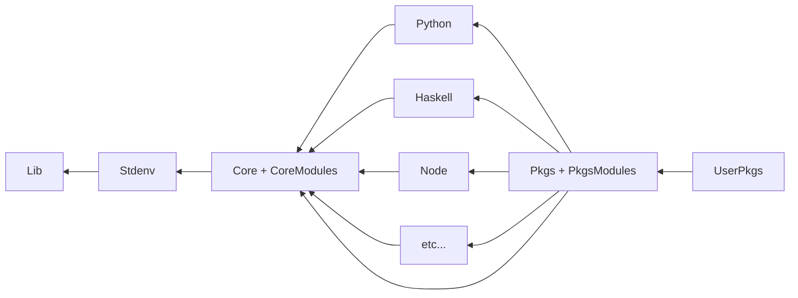

# Poly-repo Nixpkgs Fork

Why? Although a single mono-repo makes it easy for dealing with issues which
span many language ecosystems or subtle software interactions, it also causes
many maintenance issues. Issues like commit access giving "too much power", high
noise to signal ration in issues and PRs for contributors, and other issues makes
it difficult to maintain nixpkgs from a human perspective.

## Basic repository overview

Repositories will be structured in a way where the most impactful packages
can reside in the "stdenv" and "core" repositories. From this core, language
ecosystem packages and other package ecosystems can branch off of core and these
"vertical slices" can be curated independently from the others. The `pkgs` repository
allows for all of these packages to be recombined through overlays into a single package set similar
to nixpkgs. The `user-pkgs` overlay will allow for semi-official user packages to
be added, and greater freedom for individuals to contribute their additions with
less emphasis on dogmatic best practices.

## Repository descriptions

All repositories will be Nix 2.3 compatible, with optional flake.nix entry points.

- [x] [Standalone Lib](https://github.com/jonringer/nix-lib)
  - nixpkgs/lib but reduced to just nix utilities
  - lib.systems is moved to stdenv repo
  - lib.maintainers and lib.teams moved to core
- [x] [Stdenv Repo](https://github.com/jonringer/stdenv):
  - Encapsulates bootstraping the `stdenv` package for platforms.
  - Handles package splicing and cross compilation concerns
  - Contains the logic for `pkgs.config` and overlay application
  - Maintained by a dedicated team of individuals
- [x] [Core Repo](https://github.com/jonringer/core-pkgs):
  - Provides the stdenv.mkDerivations (e.g. buildPythonPackage) helpers
  - Provides a few thousand of the most common development dependencies
    - Desire here is to provide the 20% of packages which are used 80% of the time.
  - Bootstrap language ecosystem package sets.
  - Contains maintainer information
- [ ] Language package sets:
  - Contain a top-level overlay and `overrideScope` of the package set with richer set of packages
  - [X] [Python Prototype](https://github.com/jonringer/python-pkgs)
- [ ] Pkgs:
  - Combines all of the langauge package set overlays
  - Acts as the "backstop" for all packages which have "trickier" dependency requirements
- [ ] User-pkgs:
  - The NUR/"AUR" equivalent.
  - Allows for people getting started with Nix to share expressions in a semi-centralized manner
  - Linting and basic concerns for code quality still upheld, but less of an emphasis from "official" overlays

## NixOS Modules

- [ ] Core Modules
  - "Minimal" set of modules to create a usable NixOS system
  - Targeting mostly enterprise, edge compute, and single purpose systems
- [ ] Pkgs Modules
  - "Complete" set of modules, appropriate for most end-users
  - Analogous to the current nixpkgs/nixos module collection

## Additional Proposals

- [Ergonomic cross-compilation dependency terms](https://github.com/jonringer/rename-cross-deps-proposal)
- [Language-ecosystem overlays as pkgs.config options](https://github.com/jonringer/language-specific-config-overlays-proposal)
- [Standardize how packages expose versions/variants](https://github.com/jonringer/multiple-package-versions-proposal)
  - [Auto call polyPkgs to avoid awkward argument passing](https://github.com/jonringer/autocall-poly-pkgs-proposal)

## Addtional tooling

- [ ] PR review site: https://github.com/jonringer/basinix
  - Attempt to make PR reviews less risky
  - Build downstream packages (e.g. nixpkgs-review style)
    - New builds, removed builds, newly succeeding, newly failing, still succeeding, still failing

## Crazy ideas

- [ ] "GC root indexed artifact store"
  - Allow for a retention date to be passed to the post-build-hook so that nix builds can communicate how long something should live
    - This would likely need to be passed to jobset evaluation
  - Most likely use another tool to handling the gc root metadata
  - Aims to solve the "ever growing cache" concerns
- [ ] "Nix evaulator which can retain a live heap of evaluated objects to make eval diffs quick and cheap"
